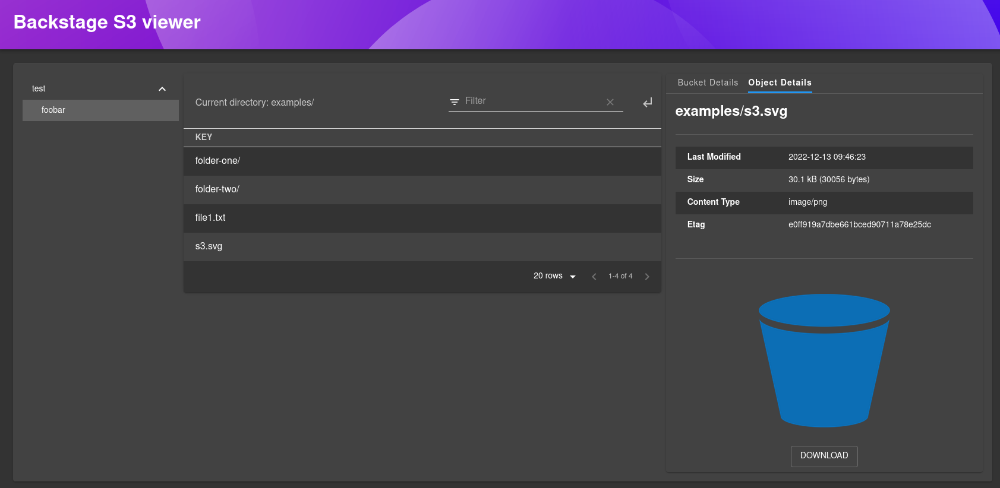

# @spreadshirt/backstage-plugin-s3-viewer

This plugin creates a new page in Backstage where the user can view the stored elements in AWS S3. The user will be able to pick a bucket from a certain endpoint and then navigate inside it similarly to a file explorer. 
The buckets and objects information will be also displayed to the user, and the objects will be possible to be downloaded or preview (if they are an image of a small size).



## Introduction

Amazon Simple Storage Service (Amazon S3) is an object storage service that offers industry-leading scalability, data availability, security, and performance.

With this plugin, you will be able to navigate around your internal AWS S3 storage using a table view, get information about a certain bucket or object, preview the object and download it.

## Getting started

To get started, follow these steps:

1. Install the plugin by running this command:
    ```bash
    # From your Backstage root directory
    yarn --cwd add packages/app @spreadshirt/backstage-plugin-s3-viewer
    ```

2. Add the new route to the app by adding the following line:
    ```typescript
    // In packages/app/src/App.tsx
    import { S3ViewerPage } from '@spreadshirt/backstage-plugin-s3-viewer';

    const routes = (
      <FlatRoutes>
        {/* ...other routes */}
        <Route path="/s3-viewer" element={<S3ViewerPage />} />
      </FlatRoutes>
    )
    ```

3. Now, add a new element to the Sidebar, so the endpoint can be easily accessible for the users. You can place it wherever you prefer:
    ```typescript
    // In packages/app/src/components/Root/Root.tsx
    import { SiAmazons3 } from 'react-icons/si';

    <SidebarPage>
      {/* ...other contents */}
      <SidebarItem icon={SiAmazons3} to="s3-viewer" text="S3 Viewer" />   
    </SidebarPage>
    ```
4. Add the configuration to the `app-config.yaml` file. This is described in the backend plugin.

## Features

- Available endpoints and buckets are displayed in a tree view. By clicking them you can select one bucket or another.
- List objects for a bucket using a file explorer style.
Display information about the selected bucket, as well as for a selected object.
- Preview of the object content (if possible) and the possibility to download it.
  - If the object is not an image, it won't be loaded.
  - For performance reasons, only images with a size below 2MB will be loaded.
- Custom URL generated depending on the selected item, this allows you to share a link with someone else pointing to a concrete endpoint, bucket and even object.
- Authenticated requests, can be authorized or rejected on the backend side depending on the user permissions.
